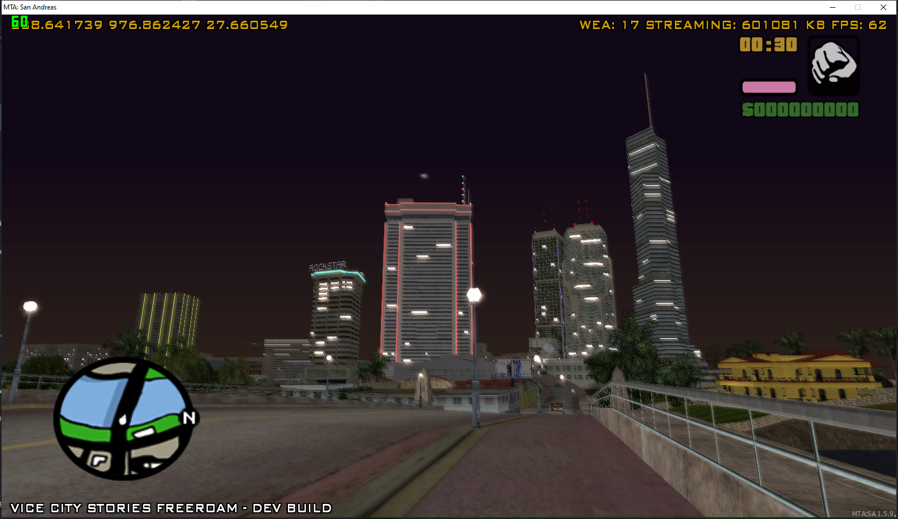

# Multi Theft Auto: Vice City Stories Map 

A Total Convention of VCS Map to MTASA with original game atmosphere.
The goal of this project is to provide a boilerplate for your further gamemode development.
This resource includes VCS styled map, hud, vehicles, weapons, peds, weather, etc.
Currently, many things are still working in progress, if you find any issue or you want to contribute, you're welcome!
# Progress
* Map
  * Interiors
  * Empire Buildings
  * Objects Fix
    * ~~Aplha Blending Textures~~
    * ~~Breakble Objects~~
    * ~~Time Object~~
    * UV Animation
    * Incorrect Objects Roatation
    * ~~Txds Mapping (Needs custom implmention fix txdp flag)~~
   * 2DFX Lighting Fix - Done
     * ~~Street Lamp (Done)~~
     * ~~Traffic Light (Done)~~ 
* Vehicle (Partially done)
* Peds
* Weapons
* HUD/UI
  * Game Texts
    * ~~Radio~~
    * ~~Vehicle Name~~
    * Zone Name
  * HUD
    * Weapon
    * ~~Health~~
    * ~~Armour~~
    * ~~Oxygen (In Water)~~
    * ~~Cash~~
* Radio Stations - Done
    * ~~Flash FM~~
    * ~~Emotion~~
    * ~~Wave 103~~
    * ~~Praradise~~
    * ~~Fresh FM~~
    * ~~VCFL~~
* Post Fx
    * Shader 
      * ~~Sun Effect~~
      * ~~Trail~~
      * ~~Radiosity~~
      * ~~Building Pipeline~~
      * Water Pipeline
      * Leeds Vehicle Pipeline
      * Grading
    * Weather
      * ~~Timecyc~~ (Note Some parameter is not supported by mta yet, but all supported have been correctly ported) 
      * ~~Color filter~~
    * Particle FX
      * ~~Water (Only the texture is ported)~~
      * ~~Clouds~~
      * Explosion FX
      * Fire
      * ~~Corona (Light Particle)~~
